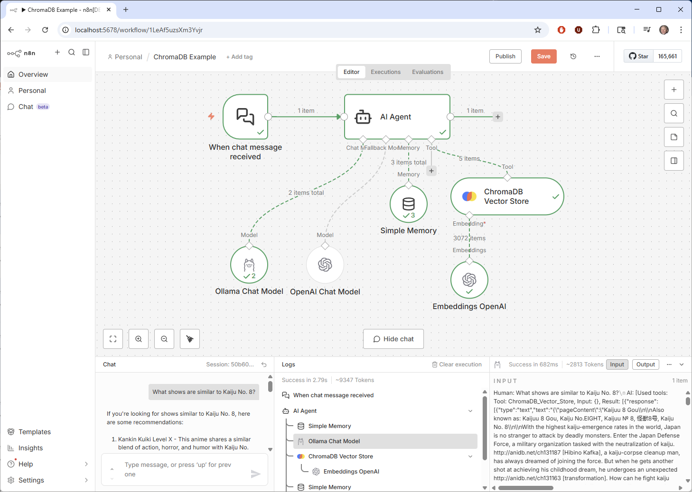

# n8n ChromaDB VectorStore Implementation Files

This directory contains the files that were created or modified to add a new ChromaDB VectorStore to n8n's service using the VectorStore abstraction with the Langchain node integration.



## VectorStoreChroma Node Implementation

The `VectorStoreChroma` node provides integration between n8n and ChromaDB for working with vector embeddings in workflows. This implementation uses n8n's VectorStore abstraction.

### Core Features

#### Extended ChromaDB Functionality
The implementation includes an `ExtendedChromaVectorStore` class that extends Langchain's base Chroma class:

- **Default Filter Support**: Maintains filters across operations
- **Similarity Search**: Merges default and runtime filters for querying
- **Langchain Integration**: Works with Langchain embedding providers

#### Operation Modes
The node supports five standard VectorStore operations:

1. **Load** - Connect to existing ChromaDB collections
2. **Insert** - Add new documents with automatic embedding generation
3. **Retrieve** - Search for similar documents using vector similarity
4. **Update** - Modify existing documents in collections
5. **Retrieve-as-Tool** - Use as a tool in AI agent workflows

#### Advanced Configuration Options

**Insert Operations**:
- **Clear Collection**: Option to clear existing collection before inserting new documents
- **Distance Functions**: Support for cosine, euclidean, and manhattan distance calculations
- **Collection Metadata**: JSON metadata association with collections
- **Batch Processing**: Configurable batch sizes (1-1000) for large-scale operations
- **Content/Metadata Payload Keys**: Customizable field mapping for document structure

**Retrieve Operations**:
- **Filtering**: Support for ChromaDB's filtering syntax with JSON-based queries
- **Metadata Control**: Options to include/exclude metadata and specify metadata keys
- **Search**: Vector similarity search with configurable result counts

**Example Filter Syntax**:
```json
{
  "$and": [
    {
      "metadata.category": {
        "$eq": "documentation"
      }
    }
  ]
}
```

#### Resource Locator Integration
The node includes a collection selector (`chromaCollectionRLC`) that:
- Loads available collections from the connected ChromaDB instance
- Provides dropdown selection and manual ID entry
- Integrates with the `chromaCollectionsSearch` method for collection discovery

#### Credential Management
Secure integration with ChromaDB through the `chromaApi` credential system:
- **URL Configuration**: Flexible ChromaDB server URL specification
- **API Key Authentication**: Optional token-based authentication
- **Connection Validation**: Built-in credential testing and validation

#### Error Handling and Validation
Error management including:
- **Parameter Validation**: Type checking and format validation for all inputs
- **Connection Error Handling**: Graceful handling of network and authentication issues
- **JSON Parsing**: Safe parsing of metadata and filter JSON with fallback handling
- **Batch Operation Resilience**: Error recovery during batch processing operations

### Technical Implementation Details

#### Class Structure
```typescript
export class VectorStoreChroma extends createVectorStoreNode<ExtendedChromaVectorStore>({
  meta: {
    displayName: 'ChromaDB Vector Store',
    name: 'vectorStoreChroma',
    description: 'Work with your data in a ChromaDB collection',
    icon: 'file:chromadb.svg',
    operationModes: ['load', 'insert', 'retrieve', 'update', 'retrieve-as-tool'],
  },
  // Implementation methods...
}) {}
```

#### Key Methods

**`getVectorStoreClient()`**: Establishes connection to ChromaDB
- Retrieves collection name and configuration parameters
- Sets up authentication and connection configuration
- Returns configured ExtendedChromaVectorStore instance

**`populateVectorStore()`**: Handles document insertion
- Processes documents in configurable batches
- Supports collection clearing and metadata association
- Handles various distance functions and embedding configurations

**`releaseVectorStoreClient()`**: Resource cleanup
- Provides interface for connection cleanup (no-op for HTTP-based ChromaDB)
- Ensures proper resource management patterns

#### UI Field Definitions
The implementation provides comprehensive UI field definitions for all operations:
- **Shared Fields**: Common parameters like collection selection
- **Insert Fields**: Batch size, distance functions, collection management options  
- **Retrieve Fields**: Search filters, metadata inclusion controls
- **Update Fields**: Document modification parameters

### Integration Benefits

#### Langchain Ecosystem
- **Embedding Compatibility**: Works with OpenAI, Hugging Face, Cohere, and other embedding providers
- **Document Processing**: Leverages Langchain's document loaders and text splitters
- **Chain Integration**: Can be used in complex AI workflows and agent systems

#### n8n Workflow Integration
- **Dynamic UI**: Resource locators that populate from live ChromaDB data
- **Credential Security**: Secure API key storage and management
- **Error Feedback**: User-friendly error messages and validation
- **Tool Capability**: Can be used as a tool in AI agent workflows for retrieval-augmented generation (RAG)

This implementation serves as an example of how to create VectorStore nodes for n8n, demonstrating patterns for UI design, error handling, and integration with the Langchain ecosystem and n8n's workflow engine.


## Key Files and Components

### Core Abstraction Layer

#### `shared/createVectorStoreNode/`
The main factory function and base implementation for all VectorStore nodes. This provides:
- **Standardized Operations**: `load`, `insert`, `retrieve`, `update`, `retrieve-as-tool`
- **Common UI Patterns**: Consistent parameter structures across vector stores
- **Error Handling**: Unified error management and validation
- **Embedding Integration**: Seamless integration with Langchain embeddings
- **Batch Processing**: Efficient handling of large document sets

#### `shared/createVectorStoreNode/methods/`
Common methods used across VectorStore implementations:
- **Collection/Index Search**: Dynamic loading of available collections
- **Validation Helpers**: Parameter and data validation utilities
- **Connection Management**: Standardized connection handling patterns

#### `shared/descriptions.ts`
Reusable UI component definitions for different vector stores:
- **Resource Locator Components** (RLC): Dynamic dropdowns for collections/indexes
- **Standard Parameters**: Common fields like collection names, metadata, filters
- **Search Methods**: Integration points for dynamic data loading

## Integration Points

### Langchain Integration
- **Embeddings**: Compatible with all Langchain embedding providers
- **Vector Stores**: Extends Langchain's vector store interfaces
- **Document Processing**: Leverages Langchain's document handling

### n8n Workflow Integration
- **Credential Management**: Secure storage and retrieval of API keys
- **Dynamic UI**: Resource locators that populate from live data
- **Error Handling**: n8n-specific error types and user feedback
- **Tool Integration**: Can be used as tools in AI agent workflows